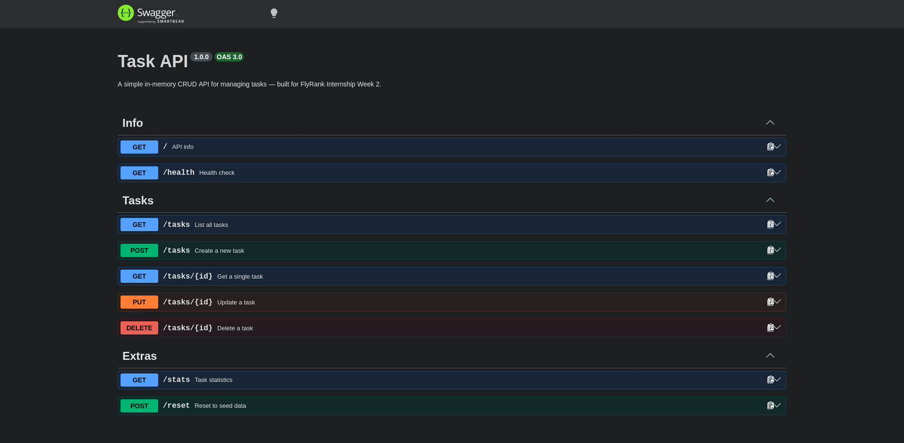

# Task API

A simple in-memory CRUD API for managing tasks — built for the **FlyRank Internship Backend Track, Week 2**.

No database. Data lives in memory and resets on restart. That's intentional — Week 3 fixes it.

---

## Install & run

```bash
npm install
npm start          # production
npm run dev        # auto-reload with nodemon (recommended during dev)
```

Server starts at **http://localhost:3000**  
Swagger UI at **http://localhost:3000/docs**

---

## Endpoints

| Method | Path | Description | Status codes |
|--------|------|-------------|--------------|
| GET | `/` | API name, version, endpoint list | 200 |
| GET | `/health` | Server health check | 200 |
| GET | `/tasks` | List all tasks (supports `?done=` and `?search=`) | 200 |
| GET | `/tasks/:id` | Get a single task | 200, 404 |
| POST | `/tasks` | Create a task `{ "title": "..." }` | 201, 400 |
| PUT | `/tasks/:id` | Update title and/or done status | 200, 400, 404 |
| DELETE | `/tasks/:id` | Delete a task | 204, 404 |
| GET | `/stats` | Task counts: total / done / open | 200 |
| POST | `/reset` | Restore the 3 seed tasks | 200 |

### Query parameters (GET /tasks)

| Param | Example | Effect |
|-------|---------|--------|
| `done` | `?done=true` | Filter by completion status |
| `search` | `?search=milk` | Case-insensitive title keyword search |

---

## curl -i sample output

```
$ curl -i -X POST http://localhost:3000/tasks \
  -H "Content-Type: application/json" \
  -d '{"title":"Buy milk"}'

HTTP/1.1 201 Created
X-Powered-By: Express
Content-Type: application/json; charset=utf-8
Content-Length: 40

{"id":4,"title":"Buy milk","done":false}
```

```
$ curl -i http://localhost:3000/tasks/99

HTTP/1.1 404 Not Found
Content-Type: application/json; charset=utf-8

{"error":"Task 99 not found"}
```

```
$ curl -i -X DELETE http://localhost:3000/tasks/1

HTTP/1.1 204 No Content
```

---

## Swagger UI

Open **http://localhost:3000/docs** after starting the server.  
Every endpoint is listed. Use **Try it out** to run the full CRUD cycle without typing a single `curl` command.



 

> 
---

## Stretch goals implemented

- **Filtering** — `GET /tasks?done=true` / `?done=false`
- **Search** — `GET /tasks?search=keyword`
- **Stats** — `GET /stats` → `{ "total": 7, "done": 3, "open": 4 }`
- **Reset** — `POST /reset` restores the 3 seed tasks (useful for demos)

---

## The mortality experiment

> *Create a few tasks, restart the server, then `GET /tasks`.*

The new tasks are gone. The 3 seed tasks are back. This is because the data lives in a JavaScript array — a variable in memory — which ceases to exist the moment the Node.js process exits. There is no file, no database, nothing persistent. Every restart is a clean slate.

This is exactly why databases exist. Week 3 fixes this with a real one.

---

## Git commit history

```
Stage 0: hello server
Stage 1: root and health endpoints
Stage 2: read endpoints with 404
Stage 3: create with validation
Stage 4: full CRUD
Stage 5: Swagger UI
Stage 6: publish and docs
Extras:  filtering, search, stats, reset
```

---

## Tech

- **Runtime** — Node.js
- **Framework** — Express
- **API docs** — swagger-ui-express + OpenAPI 3.0
- **Dev server** — nodemon
